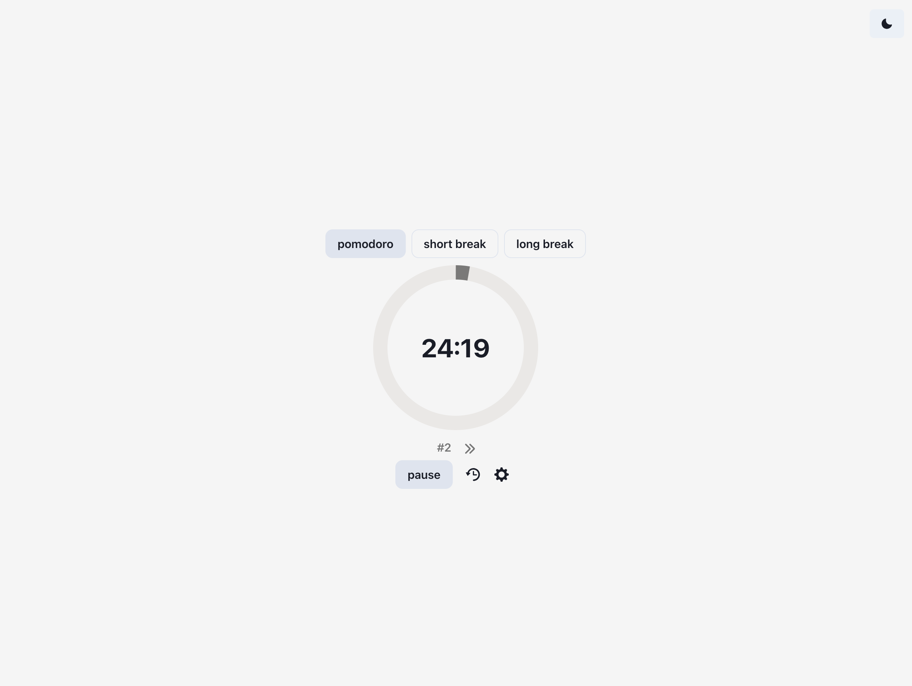
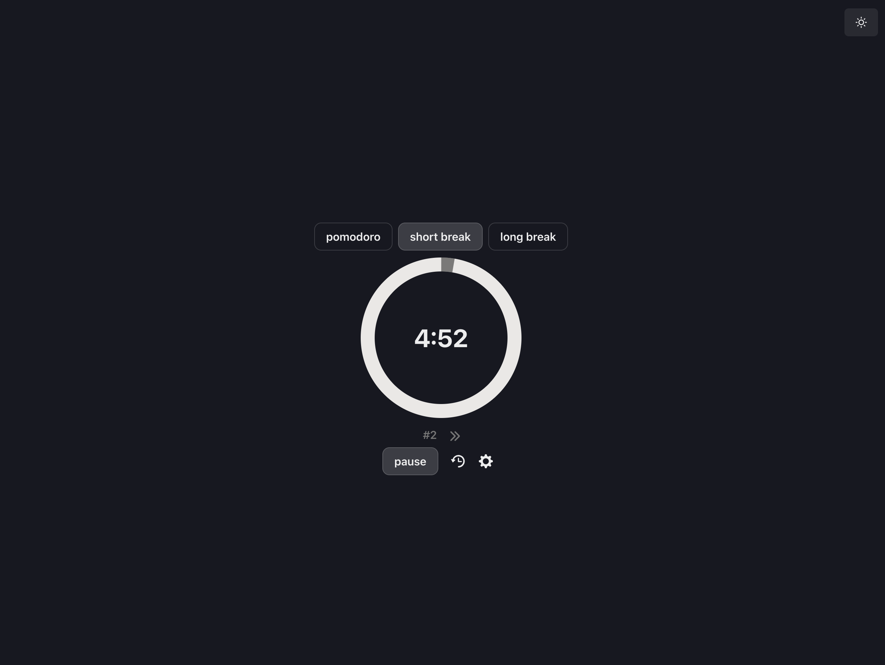

# Minimalist Pomodoro Timer App

A minimalist Pomodoro timer application built with React and Chakra UI that helps you manage your work and break cycles effectively.

# Features

- **Timer Modes**: Automatically switches between Pomodoro, short break, and long break modes
- **Timer Controls**: Start, pause, skip modes, and reset timer functionality
- **Customizable Settings**:
  - Configure duration for Pomodoro sessions (default: 25 minutes)
  - Configure short break duration (default: 5 minutes)
  - Configure long break duration (default: 15 minutes)
  - Set long break interval (default: after 4 Pomodoro sessions)
- **Session Tracking**: Counter to track completed Pomodoro sessions
- **Theme Options**: Toggle between light and dark mode (defaults to system appearance settings)

 

   
  

 

# Technologies Used

- JavaScript
- React + JSX
- Chakra UI
- Vite

# Installation and Setup

## Prerequisites

- Node.js (v14.0.0 or later recommended)
- npm or yarn package manager

## Getting Started

1. Clone the repository:
   `clone https://github.com/anapbdias/pomodoro-timer.git
cd pomodoro-timer `

2. Install dependencies:
   `npm install`

3. Start the development server:
   `npm run dev`

4. Open your browser and visit http://localhost:5173 to see the app running

## Building for Production

To create a production build:
`npm run build`

The built files will be in the dist directory and can be deployed to any static hosting service.

## Usage

1. **Start Timer**: Click the start button to begin a Pomodoro session
2. **Pause Timer**: Click the pause button to temporarily stop the timer
3. **Skip Mode**: Click the skip button to move to the next mode (e.g., from Pomodoro to break)
4. **Reset Timer**: Click the reset button to restart the current session
5. **Reset Counter**: Click the pomodoro counter to reset your pomodoro sessions
6. **Change Settings**: Access the settings menu to customize timer durations and long break intervals
7. **Switch Theme**: Toggle between light and dark mode using the theme switch
